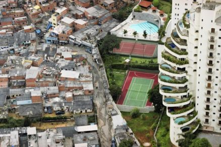
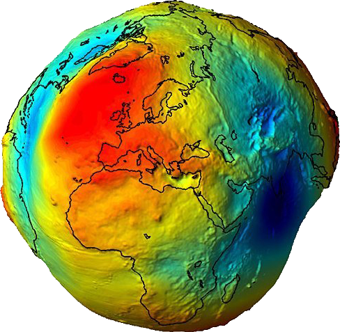
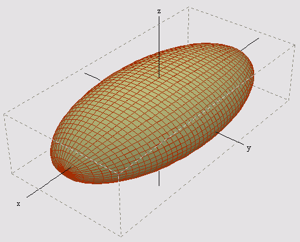
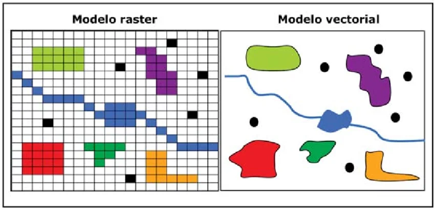
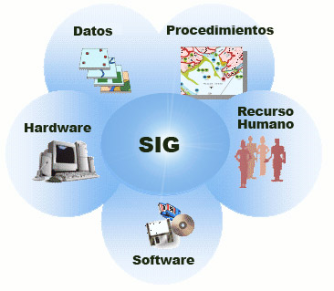
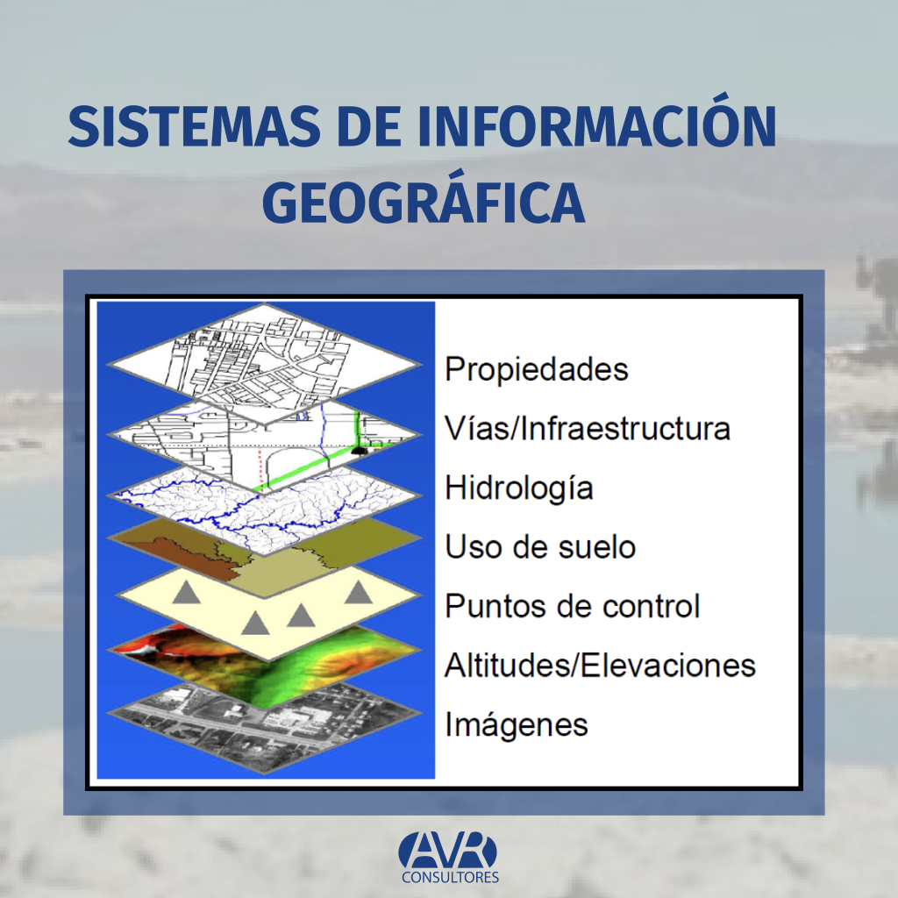

Para ubicar un dato social en un mapa hay que resolver una cadena de problemas. Cada concepto de esta página responde al problema que dejó abierto el anterior.

| Problema | Concepto que lo resuelve |
|---|---|
| ¿Qué tengo y qué quiero saber? | [Datos e información](#datos-información-y-conocimiento) |
| ¿Qué forma tiene la Tierra? | [Geoide y elipsoide](#la-forma-de-la-tierra-geoide-y-elipsoide) |
| ¿Dónde anclo ese modelo? | [Datum](#el-datum-anclar-el-modelo-a-la-tierra) |
| ¿Cómo nombro un lugar? | [Coordenadas y códigos EPSG](#coordenadas-nombrar-un-lugar) |
| ¿Cómo lo dibujo en un plano? | [Proyección](#proyección-de-la-esfera-al-plano) |
| ¿Cómo guardo la realidad? | [Modelos vector y ráster](#modelos-de-datos-vector-y-ráster) |
| ¿Cómo lo analizo todo junto? | [SIG](#sig-todo-junto) |

## 1. ¿Por qué mapear un fenómeno social?

Los fenómenos sociales ocurren en algún lugar, y **el lugar no es neutro**: la segregación, el acceso a servicios o el envejecimiento de un barrio tienen una geografía. La llamada *primera ley de la geografía* (Tobler, 1970) lo resume así: *todo está relacionado con todo, pero las cosas cercanas están más relacionadas que las lejanas*.

{fig-alt="Fotografía aérea: a la izquierda viviendas autoconstruidas de Paraisópolis; a la derecha un edificio de lujo de Morumbí con piscinas en cada balcón y canchas de tenis." width="85%"}

La imagen muestra la **desigualdad como un hecho espacial**: dos realidades sociales opuestas a pocos metros de distancia. Un promedio de la ciudad escondería ese contraste; un mapa con la escala adecuada lo hace visible.

Un mapa permite pasar de preguntar **cuánto** a preguntar **dónde**, y de ahí a **por qué ahí**.

## 2. Datos, información y conocimiento

No es lo mismo tener datos que tener información. El ejercicio de la clase recorre exactamente ese camino:

| Nivel | Qué es | En el ejercicio |
|---|---|---|
| **Datos** | Registros brutos, sin interpretar. Por sí solos no responden una pregunta | La base del Censo: en la manzana X viven 312 personas y 74 tienen 60 años o más |
| **Información** | Datos procesados, ordenados y puestos en contexto para responder una pregunta | El porcentaje de personas mayores por manzana y por comuna, clasificado y mapeado |
| **Conocimiento** | Interpretación de la información a la luz de teoría y experiencia: explica y orienta decisiones | Explicar por qué las personas mayores se concentran donde se concentran, y qué implica para la red de cuidados, salud o transporte |

El paso de datos a información **no es neutro**: elegir la variable, la unidad territorial, la tasa y la clasificación son decisiones del analista. Por eso la última parte de la clase está dedicada a leer los mapas críticamente.

## 3. La forma de la Tierra: geoide y elipsoide

La Tierra no es una esfera: está achatada en los polos y su superficie es irregular. El **geoide** es su forma "real" (la superficie del nivel medio del mar, que depende de la gravedad), pero es demasiado irregular para hacer cálculos. Por eso se usa un **elipsoide**: una figura matemática simple que se le parece mucho.

::: {layout-ncol=2}
{fig-alt="Globo terrestre deformado y coloreado de rojo a azul según la gravedad."}

{fig-alt="Elipsoide alargado dibujado con una malla sobre tres ejes."}
:::

## 4. El datum: anclar el modelo a la Tierra

Un **datum** fija un elipsoide en una posición concreta respecto de la Tierra real. Es el punto de partida de todas las coordenadas.

| Datum | Uso |
|---|---|
| **WGS 84** | GPS, Google Maps, OpenStreetMap. Estándar mundial |
| **SIRGAS-Chile** | Datum oficial de Chile. En la práctica coincide con WGS 84 a escala urbana |
| **PSAD 56** | Cartografía chilena antigua. Difiere de WGS 84 en cientos de metros |

::: {.callout-warning}
## Error típico
Mezclar capas con distinto datum sin transformarlas: las manzanas aparecen desplazadas varias cuadras respecto del mapa base.
:::

## 5. Coordenadas: nombrar un lugar

Con un datum, cada punto tiene **coordenadas geográficas**: latitud y longitud en grados. Por ejemplo, la Plaza de Armas de Santiago está cerca de −33,44° (latitud) y −70,65° (longitud).

Cada combinación de datum y sistema de coordenadas tiene un código **EPSG**, que es como su "RUT":

| Código | Nombre | Unidad |
|---|---|---|
| EPSG:4326 | WGS 84 geográficas | grados |
| EPSG:32719 | WGS 84 / UTM zona 19 Sur | metros |
| EPSG:3857 | Web Mercator (mapas web) | metros "deformados" |

## 6. Proyección: de la esfera al plano

Una pantalla o una hoja son planas; la Tierra no. **Proyectar** es transformar la superficie curva en un plano, y **toda proyección distorsiona algo**: área, forma, distancia o dirección. Hay que elegir qué conservar según el análisis.

- **UTM** divide el mundo en franjas de 6°. Chile continental usa las zonas 18S y **19S** (la RM está en la 19S). Mide en **metros** con poca distorsión local, por eso sirve para calcular áreas y densidades.
- **Web Mercator** es la proyección de Google Maps y OpenStreetMap. Conserva formas locales, pero exagera las áreas lejos del ecuador (Groenlandia parece del tamaño de África).

::: {.callout-note}
## En el ejercicio
El Bloque 6 calcula el área de una manzana en grados y luego en metros. Solo la segunda tiene sentido: para medir, hay que proyectar.
:::

## 7. Modelos de datos: vector y ráster

Una vez que sabemos *dónde*, hay que decidir *cómo guardar* la realidad.

| Modelo | Representa | Ejemplos |
|---|---|---|
| **Vector** | Objetos discretos: puntos, líneas, polígonos | Colegios (puntos), calles (líneas), manzanas y comunas (polígonos) |
| **Ráster** | Superficies continuas en una grilla de píxeles | Imagen satelital, temperatura, altitud |

{fig-alt="Comparación lado a lado de un modelo ráster en grilla de celdas y un modelo vectorial con puntos, una línea y polígonos." width="90%"}

Los datos censales son **vectoriales**: polígonos con una **tabla de atributos** (población, edad, escolaridad…) asociada a cada uno.

### Las unidades censales

Los datos del Censo se publican en unidades anidadas. Elegir una unidad es una decisión analítica, no técnica.

```{mermaid}
flowchart TD
  R[Región] --> P[Provincia] --> C[Comuna]
  C --> U["Área urbana:<br>zona → manzana"]
  C --> RU["Área rural:<br>localidad → entidad"]
```

## 8. SIG: todo junto

Un **Sistema de Información Geográfica (SIG)** no es solo un programa: combina datos espaciales, software, hardware, procedimientos y personas para responder preguntas sobre el territorio. Su lógica central es la **superposición de capas**: cada capa representa un tema (manzanas, calles, ríos, relieve) sobre la misma referencia espacial, y el análisis surge de cruzarlas.

::: {layout-ncol=2}
{fig-alt="Diagrama con SIG al centro rodeado de datos, procedimientos, recurso humano, software y hardware."}

{fig-alt="Capas apiladas: propiedades, vías, hidrología, uso de suelo, puntos de control, elevaciones e imágenes."}
:::

Sus operaciones básicas son las que haremos en el ejercicio:

| Operación | Qué hace | Bloque |
|---|---|---|
| Selección por atributo | Filtrar las manzanas del Gran Santiago | 5 |
| Reproyección | Pasar de grados a metros | 6 |
| Cálculo de campos | Crear la tasa de personas mayores | 8 |
| Agregación / disolución | Sumar manzanas por comuna | 9 |
| Unión por atributo (*join*) | Unir la tabla comunal con la geometría por código | 9 |
| Clasificación y simbología | Agrupar valores en rangos y colores (univariado y bivariado) | 11–12 |
| Exportación | Guardar en distintos formatos | 13–18 |

## Ecosistema técnico

### Software y lenguajes

| Herramienta | Tipo | Ventajas | Limitaciones |
|---|---|---|---|
| **QGIS** | SIG de escritorio | Gratuito, código abierto, muy completo | Procesos repetitivos se hacen a mano |
| **ArcGIS Pro** | SIG de escritorio | Estándar en instituciones públicas y empresas | Licencia pagada, solo Windows |
| **Python** (geopandas) | Lenguaje de programación | Reproducible, automatizable, gratuito | Requiere aprender a programar |
| **R** (sf) | Lenguaje de programación | Fuerte en estadística y ciencias sociales | Igual que Python |
| **Google Earth** | Visualizador | Fácil de usar, conocido por todos | Casi sin capacidad de análisis |

Programar no reemplaza a un SIG de escritorio: lo complementa. El código deja **registro de cada decisión**, y eso hace que el análisis sea **reproducible**: otra persona puede repetirlo y llegar al mismo resultado.

### Formatos de archivo

| Formato | Extensión | Características | Uso típico |
|---|---|---|---|
| **Shapefile** | `.shp` + `.shx` + `.dbf` + `.prj` | Antiguo (1990s) y muy difundido. Varios archivos por capa, nombres de columna de máx. 10 caracteres | Intercambio con ArcGIS |
| **GeoPackage** | `.gpkg` | Un solo archivo, varias capas, sin límites de nombres. Estándar abierto | Reemplazo moderno del Shapefile |
| **GeoJSON** | `.geojson` | Texto legible, liviano para web | Mapas web, APIs |
| **KML / KMZ** | `.kml` / `.kmz` | Formato de Google Earth. KMZ = KML comprimido | Comunicar a no especialistas |
| **GeoParquet** | `.parquet` | Columnar y comprimido, muy rápido para datos grandes | Publicación de grandes bases (Censo 2024) |
| **CSV** | `.csv` | Tabla sin geometría (o con columnas de coordenadas) | Datos tabulares que se unen por código |
| **GeoTIFF** | `.tif` | Formato ráster | Imágenes satelitales, superficies |
