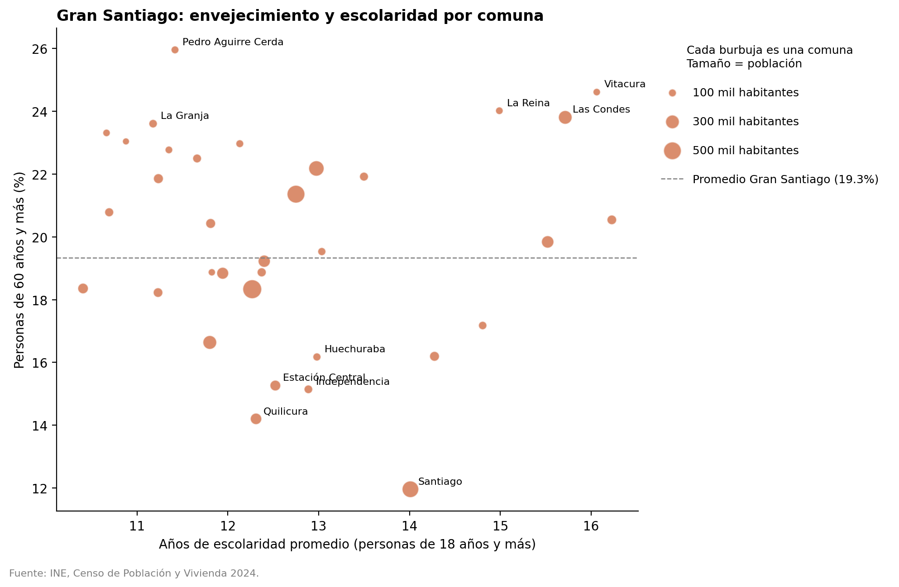
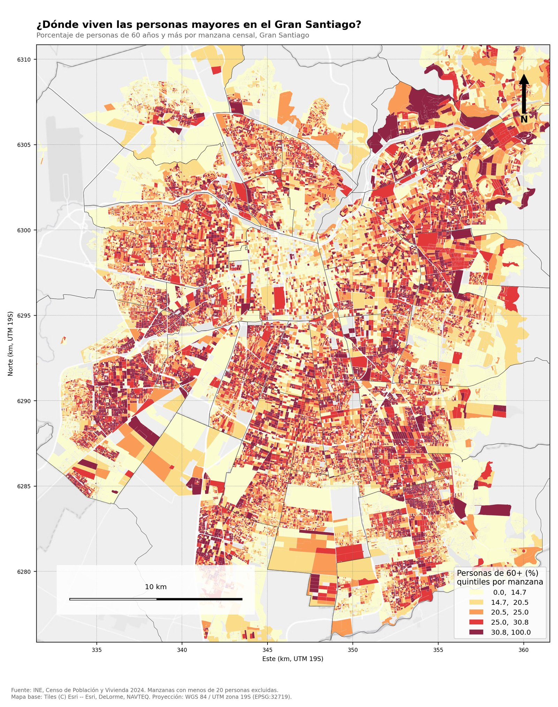
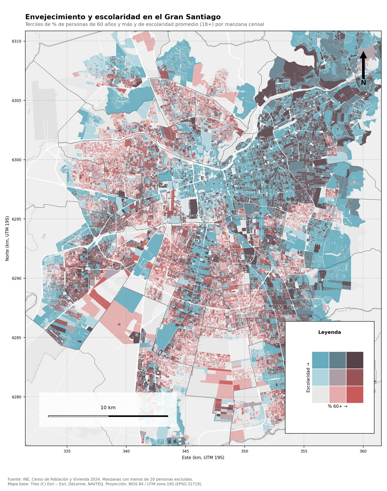

[Abrir en Google Colab](https://colab.research.google.com/github/USUARIO/REPOSITORIO/blob/main/codigo/clase_censo_rm.ipynb){.btn .btn-warning role="button"}

::: {.callout-tip}
## Antes de empezar
1. Ten una cuenta de Google y **habilita Colab** en tu Google Drive (ver [Recursos](recursos.qmd#antes-de-la-clase)).
2. Abre el notebook con el botón **Abrir en Google Colab** y guarda una copia en tu Drive (*Archivo → Guardar una copia en Drive*).
3. Ejecuta los bloques en orden. El **Bloque 2** descarga los datos del Censo 2024 desde la [carpeta compartida del docente](https://drive.google.com/drive/folders/1qzYq0RzuFlMieopEV03JyfpTOxxxWjij); no necesitas subir nada.
:::

::: {.callout-note collapse="true"}
## ¿Prefieres R? (opcional, de referencia)
El script [`clase_censo_rm.R`](codigo/clase_censo_rm.R) reproduce los mismos bloques en RStudio. No se usa en clase.
:::

```{mermaid}
flowchart LR
  A[GeoParquet INE<br>manzanas] --> B[Filtrar Gran Santiago<br>y limpiar]
  B --> C[Tasa % 60+<br>por manzana]
  C --> D[Agregar<br>por comuna]
  D --> E[Gráfico]
  C --> BI[Clasificación<br>bivariada]
  D --> BI
  BI --> F[Mapas HTML]
  BI --> G[Mapas PNG/JPG]
  BI --> H[SHP · GPKG · KMZ]
  F --> Z[ZIP descargable]
  G --> Z
  H --> Z
```

## Bloque 0 · Preparar Google Colab

Trabajamos en **Google Colab**: Python en el navegador, sin instalar nada en el computador. Colab ya trae
casi todas las librerías; este bloque agrega las que faltan. Se ejecuta **al inicio de cada sesión**.

| Librería | Para qué sirve |
|---|---|
| `geopandas` | Tablas con geometría: leer, filtrar, unir y exportar datos espaciales |
| `pyarrow` | Leer archivos Parquet / GeoParquet (formato del Censo 2024) |
| `mapclassify` | Clasificar valores en rangos (cuantiles, cortes naturales…) |
| `folium` | Mapas web interactivos |
| `contextily` | Agregar un mapa base a mapas estáticos |
| `gdown` | Descargar los datos desde la carpeta compartida del docente en Google Drive |
| `adjustText` | Acomodar las etiquetas del gráfico para que no se superpongan |
| `matplotlib` | Gráficos y mapas estáticos |

```python
%pip install -q mapclassify contextily gdown adjustText
```

## Bloque 1 · Importar librerías

Cargamos las herramientas. Si alguna línea da error `ModuleNotFoundError`, vuelve a ejecutar el Bloque 0.

```python
import json
import shutil
import zipfile
import urllib.request
from pathlib import Path
from xml.sax.saxutils import escape

import pandas as pd
import geopandas as gpd
import pyarrow.parquet as pq
import mapclassify
import folium
import contextily as cx
import matplotlib.pyplot as plt
import matplotlib.colors as mcolors
from matplotlib.lines import Line2D
from adjustText import adjust_text

pd.set_option("display.max_columns", 50)
print("geopandas", gpd.__version__)
```

## Bloque 2 · Conectar los datos y definir parámetros

**Este es el único bloque que debes revisar.** Hay tres formas de traer la cartografía del Censo 2024:

- **`"docente"` (por defecto):** Colab descarga los archivos desde la carpeta pública de Google Drive del
  docente. No necesitas subir nada.
- **`"drive"`:** si la descarga anterior falla (Google limita las descargas cuando muchas personas bajan el mismo
  archivo a la vez), copia la carpeta a tu propio Drive, en `Mi unidad/censo2024`, y usa esta opción.
  Colab pedirá permiso para acceder a tu Drive.
- **`"url"`:** si tienes un enlace de descarga directa del archivo.

No hace falta escribir la ruta del archivo: el código busca el GeoParquet de manzanas dentro de la carpeta.
También se definen aquí las **comunas del Gran Santiago** (Provincia de Santiago más Puente Alto y San Bernardo)
y el **mapa base**.

```python
# --- Origen de los datos (REVISAR) -----------------------------------------
FUENTE          = "docente"    # "docente", "drive" o "url"
CARPETA_DOCENTE = "https://drive.google.com/drive/folders/1qzYq0RzuFlMieopEV03JyfpTOxxxWjij"
CARPETA_DRIVE   = "/content/drive/MyDrive/censo2024"   # solo si FUENTE = "drive"
URL_DESCARGA    = ""                                   # solo si FUENTE = "url"

if FUENTE == "docente":
    import gdown
    CARPETA_DATOS = Path("/content/datos")
    if not any(CARPETA_DATOS.rglob("*.parquet")):
        gdown.download_folder(CARPETA_DOCENTE, output=str(CARPETA_DATOS), quiet=False)
elif FUENTE == "drive":
    from google.colab import drive
    drive.mount("/content/drive")
    CARPETA_DATOS = Path(CARPETA_DRIVE)
elif FUENTE == "url":
    CARPETA_DATOS = Path("/content/datos")
    CARPETA_DATOS.mkdir(exist_ok=True)
    descarga = CARPETA_DATOS / URL_DESCARGA.split("/")[-1].split("?")[0]
    if not descarga.exists():
        urllib.request.urlretrieve(URL_DESCARGA, descarga)
else:
    CARPETA_DATOS = Path(CARPETA_DRIVE)

# Si vienen comprimidos, los descomprimimos
for z in CARPETA_DATOS.rglob("*.zip"):
    if not any(z.parent.rglob("*.parquet")):
        zipfile.ZipFile(z).extractall(z.parent)

# Buscamos los archivos dentro de la carpeta
parquets = sorted(CARPETA_DATOS.rglob("*.parquet"))
RUTA_MANZANAS = next(p for p in parquets if "manzana" in p.name.lower())
RUTA_COMUNAS  = next((p for p in parquets if "comuna" in p.name.lower()), None)  # opcional
print("Manzanas:", RUTA_MANZANAS.name)
print("Comunas: ", RUTA_COMUNAS.name if RUTA_COMUNAS else "no encontrada (se construirán desde las manzanas)")

CARPETA_SALIDA = Path("resultados")
CARPETA_SALIDA.mkdir(exist_ok=True)

# --- Columnas de la base (según diccionario INE) ---------------------------
COL_CUT      = "CUT"                  # código único territorial de la comuna (5 dígitos)
COL_COMUNA   = "COMUNA"               # nombre de la comuna
COL_POB      = "n_per"                # total de personas
COL_MAYORES  = "n_edad_60_mas"        # personas de 60 años y más
COL_ESCOLAR  = "prom_escolaridad18"   # años de escolaridad promedio (18+)

# --- Área de estudio: Gran Santiago ----------------------------------------
# Provincia de Santiago (CUT 13101 a 13132) + Puente Alto (13201) + San Bernardo (13401)
COMUNAS_GS = [f"131{n:02d}" for n in range(1, 33)] + ["13201", "13401"]

# --- Parámetros de análisis y mapas ----------------------------------------
MIN_PERSONAS = 20                              # manzanas con menos personas no se usan para tasas
CRS_METROS   = 32719                           # WGS 84 / UTM zona 19S: metros para Chile central
MAPA_BASE    = cx.providers.Esri.WorldGrayCanvas   # mapa base gris, sin bloqueos de uso
```

## Bloque 3 · Explorar el archivo antes de cargarlo

El archivo nacional tiene cerca de 200 columnas y cientos de miles de manzanas. Antes de cargarlo, leemos solo
su **esquema** (lista de columnas) para saber qué variables trae. Así evitamos llenar la memoria de Colab (unos 12 GB en la versión gratuita).

```python
esquema = pq.read_schema(RUTA_MANZANAS)
columnas = esquema.names
print(f"El archivo tiene {len(columnas)} columnas")

# Columna de geometría declarada en los metadatos GeoParquet
geo_meta = json.loads(esquema.metadata[b"geo"])
COL_GEOM = geo_meta["primary_column"]
print("Columna de geometría:", COL_GEOM)

# ¿Qué variables de edad y escolaridad existen?
print([c for c in columnas if "edad" in c.lower() or "escol" in c.lower()])
```

## Bloque 4 · Cargar solo las columnas necesarias

Leemos el GeoParquet con `geopandas`, pidiendo únicamente las columnas que usaremos. El resultado es un
**GeoDataFrame**: una tabla como Excel, pero con una columna de geometría (el polígono de cada manzana).

```python
columnas_usar = [COL_CUT, COL_COMUNA, COL_POB, COL_MAYORES, COL_ESCOLAR, COL_GEOM]
manzanas = gpd.read_parquet(RUTA_MANZANAS, columns=columnas_usar)
if manzanas.geometry.name != "geometry":          # usamos siempre el nombre estándar "geometry"
    manzanas = manzanas.rename_geometry("geometry")

print(manzanas.shape)
manzanas.head()
```

## Bloque 5 · Filtrar el Gran Santiago

Nos quedamos con las 34 comunas del **Gran Santiago**: las 32 de la Provincia de Santiago, más Puente Alto y
San Bernardo. Es una **selección por atributo**: filtramos filas según el código comunal `CUT`.

Los códigos territoriales se tratan como **texto**, no como números: si `CUT` se lee como número, la comuna
`05101` pierde el cero inicial y los cruces fallan.

```python
manzanas[COL_CUT] = manzanas[COL_CUT].astype(str).str.zfill(5)

gs = manzanas[manzanas[COL_CUT].isin(COMUNAS_GS)].copy()
del manzanas  # liberamos memoria

print(f"Manzanas en el Gran Santiago: {len(gs):,}")
print(f"Comunas: {gs[COL_CUT].nunique()} de {len(COMUNAS_GS)}")
```

## Bloque 6 · Revisar el sistema de coordenadas

Todo dato espacial tiene un **sistema de referencia de coordenadas (CRS)**. La cartografía viene en
coordenadas geográficas (grados de latitud y longitud). Para medir áreas o distancias necesitamos una
**proyección en metros**: usamos UTM zona 19 Sur (EPSG:32719).

Compara el área calculada en grados con el área en m²: la primera no tiene sentido físico.

```python
print("CRS original:", gs.crs.name if gs.crs else "sin CRS", "| EPSG:", gs.crs.to_epsg() if gs.crs else "-")
if gs.crs is None:                      # por seguridad, si el archivo no declara CRS
    gs = gs.set_crs(4326)

# Área en coordenadas geográficas: el resultado está en "grados cuadrados" (sin sentido físico)
print("Área 1ª manzana en grados²:", gs.geometry.iloc[0].area)

gs = gs.to_crs(CRS_METROS)
print("Área 1ª manzana en m²:     ", round(gs.geometry.iloc[0].area))
print("CRS de trabajo:", gs.crs.name, "| EPSG:", gs.crs.to_epsg())
```

## Bloque 7 · Limpiar los datos

Por confidencialidad, el INE puede **suprimir valores** en manzanas con muy pocas personas (quedan vacíos o con
códigos negativos). Los convertimos en valores faltantes y marcamos las manzanas demasiado pequeñas para
calcular una tasa confiable.

```python
for col in [COL_POB, COL_MAYORES, COL_ESCOLAR]:
    gs[col] = pd.to_numeric(gs[col], errors="coerce")
    gs[col] = gs[col].mask(gs[col] < 0)        # valores negativos → faltantes

gs["valida"] = gs[COL_POB] >= MIN_PERSONAS
print(f"Manzanas con al menos {MIN_PERSONAS} personas: {gs['valida'].sum():,} de {len(gs):,}")
print(gs[[COL_POB, COL_MAYORES, COL_ESCOLAR]].isna().sum())
```

## Bloque 8 · Calcular el indicador por manzana

Un mapa de **conteos** solo muestra dónde vive más gente. Para comparar territorios usamos una **tasa**:
porcentaje de personas de 60 años y más sobre la población total de la manzana.

También definimos la **extensión del mapa** a partir de las manzanas con datos, para que los mapas se centren
en la zona urbana y no en los cerros despoblados.

```python
gs["pct_60"] = (gs[COL_MAYORES] / gs[COL_POB] * 100).where(gs["valida"])

centros = gs[gs["valida"]].geometry.centroid
xmin, xmax = centros.x.quantile([0.005, 0.995]) + [-1500, 1500]
ymin, ymax = centros.y.quantile([0.005, 0.995]) + [-1500, 1500]

gs["pct_60"].describe().round(1)
```

## Bloque 9 · Agregar a nivel comunal

Sumamos personas por comuna (**agregación**) y recalculamos la tasa. La escolaridad promedio comunal se
aproxima ponderando el promedio de cada manzana por su población.

Luego unimos esa tabla con la geometría de las comunas mediante el código `CUT` (**unión por atributo**).
Si no hay capa de comunas, se construye disolviendo las manzanas.

```python
gs["_escol_x_pob"] = gs[COL_ESCOLAR] * gs[COL_POB]
gs["_pob_escol"]   = gs[COL_POB].where(gs[COL_ESCOLAR].notna())   # población con dato de escolaridad

tabla = (gs.groupby([COL_CUT, COL_COMUNA], as_index=False)
           .agg(poblacion=(COL_POB, "sum"),
                mayores=(COL_MAYORES, "sum"),
                _escol=("_escol_x_pob", "sum"),
                _pob_escol=("_pob_escol", "sum")))
tabla["pct_60"]  = tabla["mayores"] / tabla["poblacion"] * 100
tabla["escolar"] = tabla["_escol"] / tabla["_pob_escol"]
tabla = tabla.drop(columns=["_escol", "_pob_escol"])

if RUTA_COMUNAS:
    capa = gpd.read_parquet(RUTA_COMUNAS).to_crs(CRS_METROS)
    if capa.geometry.name != "geometry":
        capa = capa.rename_geometry("geometry")
    col_cut_capa = next(c for c in capa.columns if c.upper() in ("CUT", "COD_COMUNA", "CODIGO_COMUNA"))
    capa[col_cut_capa] = capa[col_cut_capa].astype(str).str.zfill(5)
    comunas = capa[[col_cut_capa, "geometry"]].rename(columns={col_cut_capa: COL_CUT})
else:
    comunas = gs[[COL_CUT, "geometry"]].dissolve(by=COL_CUT).reset_index()

comunas = comunas.merge(tabla, on=COL_CUT, how="inner")
comunas["densidad"] = comunas["poblacion"] / (comunas.geometry.area / 1_000_000)
comunas["geometry"] = comunas.geometry.simplify(25)   # aligera el archivo (tolerancia 25 m)

print(f"{len(comunas)} comunas")
comunas.drop(columns="geometry").sort_values("pct_60", ascending=False).head(10).round(1)
```

## Bloque 10 · Gráfico: envejecimiento y escolaridad por comuna

Antes del mapa, una mirada **no espacial**: ¿se relaciona el envejecimiento con el nivel educativo de la
comuna? Cada burbuja es una comuna y su tamaño representa su población (ver leyenda). La línea punteada
marca el promedio del Gran Santiago. Las etiquetas se acomodan solas con `adjustText` para no superponerse.

```python
ESCALA_BURBUJA = 2500        # habitantes por unidad de tamaño de burbuja

fig, ax = plt.subplots(figsize=(10, 6.5))
ax.scatter(comunas["escolar"], comunas["pct_60"], s=comunas["poblacion"] / ESCALA_BURBUJA,
           alpha=0.6, color="#c2410c", edgecolor="white", linewidth=0.8)

promedio_gs = comunas["mayores"].sum() / comunas["poblacion"].sum() * 100
ax.axhline(promedio_gs, color="grey", linestyle="--", linewidth=0.9)

# Etiquetamos las 5 comunas más y menos envejecidas; adjust_text las separa y las une con una línea
extremos = pd.concat([comunas.nlargest(5, "pct_60"), comunas.nsmallest(5, "pct_60")])
textos = [ax.text(f["escolar"], f["pct_60"], f[COL_COMUNA].title(), fontsize=8.5)
          for _, f in extremos.iterrows()]
adjust_text(textos, x=comunas["escolar"].tolist(), y=comunas["pct_60"].tolist(), ax=ax,
            expand=(1.3, 1.6), arrowprops=dict(arrowstyle="-", color="grey", lw=0.6))

# Leyenda: tamaños de referencia + línea de promedio
referencias = [100_000, 300_000, 500_000]
manejadores = [plt.scatter([], [], s=v / ESCALA_BURBUJA, color="#c2410c", alpha=0.6, edgecolor="white")
               for v in referencias]
etiquetas = [f"{v // 1000} mil habitantes" for v in referencias]
manejadores.append(Line2D([0], [0], color="grey", linestyle="--", linewidth=0.9))
etiquetas.append(f"Promedio Gran Santiago ({promedio_gs:.1f}%)")
ax.legend(manejadores, etiquetas, title="Cada burbuja es una comuna\nTamaño = población",
          loc="upper left", bbox_to_anchor=(1.01, 1), frameon=False, labelspacing=1.6,
          borderpad=1, fontsize=9, title_fontsize=9)

ax.set_xlabel("Años de escolaridad promedio (personas de 18 años y más)")
ax.set_ylabel("Personas de 60 años y más (%)")
ax.set_title("Gran Santiago: envejecimiento y escolaridad por comuna", loc="left", fontweight="bold")
ax.spines[["top", "right"]].set_visible(False)
fig.text(0.01, 0.01, "Fuente: INE, Censo de Población y Vivienda 2024.", fontsize=8, color="grey")
plt.tight_layout(rect=(0, 0.03, 1, 1))
fig.savefig(CARPETA_SALIDA / "grafico_envejecimiento_escolaridad.png", dpi=200, bbox_inches="tight")
plt.show()
```

{.lightbox}

## Bloque 11 · Mismo dato, distinto mapa: métodos de clasificación

Un mapa coroplético agrupa valores en rangos. **El método elegido cambia el mensaje.** Comparamos
*cuantiles* (igual número de comunas por color) con *intervalos iguales* (rangos del mismo ancho).

```python
fig, axes = plt.subplots(1, 2, figsize=(13, 6))
for ax, metodo, titulo in zip(axes, ["Quantiles", "EqualInterval"], ["Cuantiles", "Intervalos iguales"]):
    comunas.plot(column="pct_60", scheme=metodo, k=5, cmap="YlOrRd",
                 edgecolor="white", linewidth=0.3, legend=True, ax=ax,
                 legend_kwds={"loc": "lower left", "fontsize": 8, "title": "% 60+", "fmt": "{:.1f}"})
    ax.set_title(titulo, fontweight="bold")
    ax.set_axis_off()
plt.suptitle("¿Cuál de los dos mapas 'dice la verdad'?")
plt.tight_layout()
plt.show()
```

## Bloque 12 · Clasificación bivariada: envejecimiento y escolaridad

Un **mapa coroplético bivariado** muestra dos variables a la vez. Cada variable se divide en tres grupos
(*terciles*: bajo, medio, alto) y se combinan en una grilla de 3 × 3 = 9 colores:

- el eje horizontal (rojo) es el **% de personas de 60 años y más**;
- el eje vertical (azul) es la **escolaridad promedio**;
- el color oscuro de la esquina indica **alto en ambas**; el gris claro, **bajo en ambas**.

Aquí definimos la clasificación y la leyenda, que se reutilizan en todos los formatos (PNG, HTML, Shapefile,
GeoPackage y KMZ).

```python
# Paleta bivariada 3 × 3 (J. Stevens). Clave: "x-y" con x = % 60+ e y = escolaridad (1 bajo, 3 alto)
PALETA_BI = {"1-1": "#e8e8e8", "2-1": "#e4acac", "3-1": "#c85a5a",
             "1-2": "#b0d5df", "2-2": "#ad9ea5", "3-2": "#985356",
             "1-3": "#64acbe", "2-3": "#627f8c", "3-3": "#574249"}
NOMBRE_X, NOMBRE_Y = "% 60+", "Escolaridad"

def clasificar_bivariado(gdf, col_x, col_y):
    # Terciles de cada variable (1 = bajo, 2 = medio, 3 = alto) y su combinación
    tx = pd.qcut(gdf[col_x].rank(method="first"), 3, labels=False) + 1
    ty = pd.qcut(gdf[col_y].rank(method="first"), 3, labels=False) + 1
    clase = tx.astype(int).astype(str) + "-" + ty.astype(int).astype(str)
    return clase, clase.map(PALETA_BI)

def dibujar_leyenda_bivariada(ax, fontsize=8):
    for (clave, color) in PALETA_BI.items():
        x, y = (int(v) for v in clave.split("-"))
        ax.add_patch(plt.Rectangle((x - 1, y - 1), 1, 1, facecolor=color, edgecolor="white", linewidth=1))
    ax.set_xlim(0, 3); ax.set_ylim(0, 3); ax.set_aspect("equal")
    ax.set_xticks([]); ax.set_yticks([])
    for s in ax.spines.values():
        s.set_visible(False)
    ax.set_xlabel(f"{NOMBRE_X} →", fontsize=fontsize, labelpad=2)
    ax.set_ylabel(f"{NOMBRE_Y} →", fontsize=fontsize, labelpad=2)

# Por manzana (para el mapa estático) y por comuna (para HTML, Shapefile, GeoPackage y KMZ)
bi = gs["valida"] & gs["pct_60"].notna() & gs[COL_ESCOLAR].notna()
gs.loc[bi, "bi_clase"], gs.loc[bi, "bi_color"] = clasificar_bivariado(gs[bi], "pct_60", COL_ESCOLAR)
comunas["bi_clase"], comunas["bi_color"] = clasificar_bivariado(comunas, "pct_60", "escolar")

fig, ax = plt.subplots(figsize=(2.2, 2.2))
dibujar_leyenda_bivariada(ax)
plt.show()
comunas.groupby("bi_clase")[COL_COMUNA].apply(lambda s: ", ".join(s.str.title()))
```

## Bloque 13 · Mapas interactivos (HTML)

`explore()` crea mapas web con **folium/Leaflet**. Se puede hacer zoom y, al pasar el mouse, ver los datos de
cada comuna. Se guardan como **HTML**: una vez descargados (Bloque 20) se abren con doble clic en cualquier
navegador y se pueden enviar por correo o subir a una web.

Usamos el mapa base gris de **Esri**: los servidores de OpenStreetMap bloquean ("Access blocked") los mapas
que se abren desde un archivo local o desde Colab, porque su política de uso exige identificar el sitio web.

Se generan dos mapas: el **univariado** (% 60+) y el **bivariado** (% 60+ y escolaridad).

```python
info = [COL_COMUNA, "pct_60", "escolar", "poblacion"]
alias = ["Comuna", "% 60+", "Escolaridad (años)", "Población"]

# 1) Mapa univariado
mapa_web = comunas.explore(
    column="pct_60", scheme="Quantiles", k=5, cmap="YlOrRd", tiles=MAPA_BASE,
    tooltip=info, tooltip_kwds={"aliases": alias, "localize": True},
    style_kwds={"weight": 0.6, "color": "white", "fillOpacity": 0.75},
    legend_kwds={"caption": "Personas de 60 años y más (%)", "fmt": "{:.1f}"},
)
mapa_web.save(CARPETA_SALIDA / "mapa_interactivo_60mas.html")

# 2) Mapa bivariado: cada comuna con su color y una leyenda 3 × 3 dibujada en HTML
mapa_bi = comunas.explore(
    color=comunas["bi_color"].tolist(), tiles=MAPA_BASE,
    tooltip=info + ["bi_clase"], tooltip_kwds={"aliases": alias + ["Clase (60+ - escolaridad)"], "localize": True},
    style_kwds={"weight": 0.6, "color": "white", "fillOpacity": 0.85},
)
celdas = "".join(
    f'<div style="background:{PALETA_BI[f"{x}-{y}"]};width:22px;height:22px"></div>'
    for y in (3, 2, 1) for x in (1, 2, 3))
leyenda_html = f'''
<div style="position:fixed;bottom:24px;left:24px;z-index:9999;background:white;padding:10px 12px;
            border-radius:6px;box-shadow:0 1px 4px rgba(0,0,0,.3);font:12px sans-serif">
  <b>Envejecimiento y escolaridad</b>
  <div style="display:flex;align-items:center;gap:6px;margin-top:6px">
    <div style="writing-mode:vertical-rl;transform:rotate(180deg)">Escolaridad →</div>
    <div style="display:grid;grid-template-columns:repeat(3,22px);gap:1px">{celdas}</div>
  </div>
  <div style="margin-left:22px">% 60+ →</div>
</div>'''
mapa_bi.get_root().html.add_child(folium.Element(leyenda_html))
mapa_bi.save(CARPETA_SALIDA / "mapa_interactivo_bivariado.html")

mapa_bi
```

## Bloque 14 · Mapa estático por manzana con mapa base

Cambiamos de escala: de 34 comunas a decenas de miles de manzanas. Aparecen patrones **dentro** de las
comunas que el promedio comunal escondía. Este primer mapa está **incompleto a propósito**: lo
terminaremos en la parte de cartografía.

```python
fig, ax = plt.subplots(figsize=(10, 10))
gs[gs["valida"]].plot(column="pct_60", scheme="Quantiles", k=5, cmap="YlOrRd",
                      linewidth=0, alpha=0.85, ax=ax, legend=True)
ax.set_xlim(xmin, xmax); ax.set_ylim(ymin, ymax)
try:
    cx.add_basemap(ax, crs=gs.crs, source=MAPA_BASE)
except Exception as e:
    print("Sin mapa base (¿sin internet?):", e)
plt.show()
```

## Bloque 15 · Mapa profesional: elementos cartográficos (PNG / JPG)

Agregamos lo que distingue un mapa de un gráfico: **título** que comunica el hallazgo, **leyenda** con
unidades, **escala gráfica**, **norte**, **grilla** de coordenadas, **fuente** y **mapa base** con su
atribución.

Para que ningún elemento tape manzanas, la leyenda, la escala y el norte van **fuera del marco del mapa**, en una
franja inferior. Los elementos se agrupan en **funciones** para reutilizarlas en el mapa bivariado.

```python
from matplotlib.patches import Patch
from matplotlib.transforms import blended_transform_factory

ANCHO_MAPA, MARGEN_SUP, MARGEN_INF = 8.6, 0.9, 2.5        # en pulgadas

def figura_mapa():
    # Figura con el mapa arriba y una franja inferior para leyenda, escala y norte
    alto_mapa = ANCHO_MAPA * (ymax - ymin) / (xmax - xmin)
    alto = alto_mapa + MARGEN_SUP + MARGEN_INF
    fig = plt.figure(figsize=(10, alto))
    ax = fig.add_axes([0.9 / 10, MARGEN_INF / alto, ANCHO_MAPA / 10, alto_mapa / alto])
    return fig, ax

def bajo_el_mapa(ax, pulgadas):
    # Posición vertical (en fracción del eje) a cierta distancia bajo el borde inferior del mapa
    alto_mapa = ax.get_position().height * ax.figure.get_figheight()
    return -pulgadas / alto_mapa

def elementos_cartograficos(fig, ax, titulo, subtitulo):
    ax.set_xlim(xmin, xmax); ax.set_ylim(ymin, ymax); ax.set_aspect("equal")
    comunas.boundary.plot(ax=ax, color="#444444", linewidth=0.4)
    try:
        cx.add_basemap(ax, crs=gs.crs, source=MAPA_BASE, attribution=False, zorder=0)
    except Exception as e:
        print("Sin mapa base:", e)
    # Título (comunica el hallazgo) y subtítulo (qué, dónde, unidad)
    ax.set_title(titulo, loc="left", fontsize=13, fontweight="bold", pad=22)
    ax.text(0, 1.01, subtitulo, transform=ax.transAxes, fontsize=9, color="dimgrey", va="bottom")
    # Grilla en km (coordenadas UTM 19S)
    ax.grid(True, linestyle=":", linewidth=0.5, color="grey")
    ax.xaxis.set_major_formatter(lambda v, _: f"{v/1000:.0f}")
    ax.yaxis.set_major_formatter(lambda v, _: f"{v/1000:.0f}")
    ax.set_xlabel("Este (km, UTM 19S)", fontsize=8); ax.set_ylabel("Norte (km, UTM 19S)", fontsize=8)
    ax.tick_params(labelsize=7)
    # Escala gráfica de 10 km bajo el mapa, a la izquierda del norte (x en metros, y en fracción del eje)
    t = blended_transform_factory(ax.transData, ax.transAxes)
    x0, y0 = xmin + 0.86 * (xmax - xmin) - 10_000, bajo_el_mapa(ax, 1.25)
    for i, color in enumerate(["black", "white", "black", "white"]):
        ax.add_patch(plt.Rectangle((x0 + i * 2_500, y0), 2_500, 0.012, transform=t, clip_on=False,
                                   facecolor=color, edgecolor="black", linewidth=0.8))
    for km in (0, 5, 10):
        ax.text(x0 + km * 1000, y0 - 0.008, f"{km}" + (" km" if km == 10 else ""), transform=t,
                ha="center", va="top", fontsize=8)
    # Flecha norte bajo el mapa, a la derecha
    ax.annotate("N", xy=(0.95, bajo_el_mapa(ax, 0.8)), xytext=(0.95, bajo_el_mapa(ax, 1.6)),
                xycoords="axes fraction", ha="center", va="center", fontsize=12, fontweight="bold",
                arrowprops=dict(facecolor="black", width=4, headwidth=12), annotation_clip=False)
    # Fuente y créditos
    fig.text(0.09, 0.012,
             f"Fuente: INE, Censo de Población y Vivienda 2024. Manzanas con menos de {MIN_PERSONAS} personas excluidas.\n"
             f"Mapa base: {MAPA_BASE.attribution}. Proyección: WGS 84 / UTM zona 19S (EPSG:{CRS_METROS}).",
             fontsize=7, color="dimgrey", va="bottom")

# Clasificación por quintiles con colores fijos (los mismos del KMZ)
k = 5
validas = gs[gs["valida"]].copy()
quintiles = mapclassify.Quantiles(validas["pct_60"], k=k)
COLORES_60 = [mcolors.to_hex(c) for c in plt.get_cmap("YlOrRd", k)(range(k))]
validas["color"] = [COLORES_60[c] for c in quintiles.yb]
limites = [validas["pct_60"].min(), *quintiles.bins]

# Un buen título comunica el HALLAZGO. Reemplázalo por lo que muestran tus datos.
TITULO = "¿Dónde viven las personas mayores en el Gran Santiago?"

fig, ax = figura_mapa()
validas.plot(color=validas["color"].tolist(), linewidth=0, alpha=0.9, ax=ax)
elementos_cartograficos(fig, ax, TITULO,
                        "Porcentaje de personas de 60 años y más por manzana censal, Gran Santiago")
cuadros = [Patch(facecolor=c, edgecolor="none", label=f"{limites[i]:.1f} – {limites[i + 1]:.1f}")
           for i, c in enumerate(COLORES_60)]
ax.legend(handles=cuadros, title="Personas de 60 años y más (%)\nquintiles por manzana", loc="upper left",
          bbox_to_anchor=(0, bajo_el_mapa(ax, 0.6)), frameon=False, fontsize=8.5, title_fontsize=9,
          alignment="left")
fig.savefig(CARPETA_SALIDA / "mapa_60mas_manzanas.png", dpi=250)
fig.savefig(CARPETA_SALIDA / "mapa_60mas_manzanas.jpg", dpi=250, pil_kwargs={"quality": 90})
plt.show()
```

{.lightbox}

## Bloque 16 · Mapa bivariado profesional (PNG / JPG)

El mismo diseño cartográfico, ahora con la clasificación bivariada por manzana. La leyenda 3 × 3 se lee como
un plano: hacia la derecha aumenta el % de personas mayores; hacia arriba, la escolaridad.

```python
TITULO_BI = "Envejecimiento y escolaridad en el Gran Santiago"

con_bi = gs[gs["bi_color"].notna()]
fig, ax = figura_mapa()
con_bi.plot(color=con_bi["bi_color"].tolist(), linewidth=0, alpha=0.9, ax=ax)
elementos_cartograficos(fig, ax, TITULO_BI,
                        "Terciles de % de personas de 60 años y más y de escolaridad promedio (18+) por manzana censal")

# Leyenda 3 × 3 bajo el mapa, a la izquierda (1,1 pulgadas de lado)
lado = 1.1
alto_mapa = ax.get_position().height * fig.get_figheight()
ax_ley = ax.inset_axes([0.45 / ANCHO_MAPA, bajo_el_mapa(ax, 0.75 + lado), lado / ANCHO_MAPA, lado / alto_mapa])
dibujar_leyenda_bivariada(ax_ley)
ax_ley.set_title("Envejecimiento y escolaridad", fontsize=8.5, fontweight="bold", loc="left")
ax.text(0.45 / ANCHO_MAPA + lado / ANCHO_MAPA + 0.03, bajo_el_mapa(ax, 0.95),
        "Oscuro: alto en ambas\nRojo: más mayores, menor escolaridad\n"
        "Azul: menos mayores, mayor escolaridad\nGris: bajo en ambas",
        transform=ax.transAxes, fontsize=7.5, va="top", color="dimgrey", linespacing=1.6)

fig.savefig(CARPETA_SALIDA / "mapa_bivariado_manzanas.png", dpi=250)
fig.savefig(CARPETA_SALIDA / "mapa_bivariado_manzanas.jpg", dpi=250, pil_kwargs={"quality": 90})
plt.show()
```

{.lightbox}

## Bloque 17 · Exportar a Shapefile y GeoPackage (ArcGIS / QGIS)

El **Shapefile** es el formato más difundido, pero tiene límites de los años 90: nombres de columna de máximo
10 caracteres, varios archivos por capa (`.shp`, `.shx`, `.dbf`, `.prj`, `.cpg`) y problemas con tildes.
El **GeoPackage** (`.gpkg`) es el estándar moderno: un solo archivo, varias capas, sin esas restricciones.
Ambos abren en ArcGIS y QGIS. Se incluyen las columnas `bi_clase` y `bi_color` para simbolizar el mapa
bivariado.

```python
salida = comunas.rename(columns={COL_COMUNA: "comuna", "poblacion": "pob", "mayores": "pob_60mas",
                                 "pct_60": "pct_60mas", "escolar": "escolarid", "densidad": "dens_km2"})

carpeta_shp = CARPETA_SALIDA / "shp"
carpeta_shp.mkdir(exist_ok=True)
salida.to_file(carpeta_shp / "comunas_gran_santiago.shp", encoding="utf-8")

gpkg = CARPETA_SALIDA / "censo2024_gran_santiago.gpkg"
salida.to_file(gpkg, layer="comunas", driver="GPKG")
gs[gs["valida"]][[COL_CUT, COL_COMUNA, COL_POB, COL_MAYORES, COL_ESCOLAR, "pct_60", "bi_clase", "bi_color", "geometry"]].to_file(
    gpkg, layer="manzanas", driver="GPKG")

print(sorted(p.name for p in carpeta_shp.iterdir()))
```

## Bloque 18 · Exportar a KMZ (Google Earth)

El **KML/KMZ** es el formato de Google Earth. Exige coordenadas geográficas WGS 84 (EPSG:4326), así que
reproyectamos. Escribimos el KML directamente para incluir **el color de cada comuna y una leyenda**
(la exportación estándar no guarda colores). Se generan dos archivos: univariado y bivariado.
No es necesario entender la función línea a línea.

```python
def a_color_kml(hex_color, opacidad=0.75):
    r, g, b = (int(hex_color[i:i + 2], 16) for i in (1, 3, 5))
    return f"{int(opacidad * 255):02x}{b:02x}{g:02x}{r:02x}"     # KML usa aabbggrr

def anillo(coords):
    return " ".join(f"{x:.6f},{y:.6f},0" for x, y in coords)

def poligono_kml(poly):
    texto = f"<Polygon><outerBoundaryIs><LinearRing><coordinates>{anillo(poly.exterior.coords)}</coordinates></LinearRing></outerBoundaryIs>"
    for hueco in poly.interiors:
        texto += f"<innerBoundaryIs><LinearRing><coordinates>{anillo(hueco.coords)}</coordinates></LinearRing></innerBoundaryIs>"
    return texto + "</Polygon>"

def exportar_kmz(gdf, col_color, col_nombre, cols_info, ruta, titulo, fig_leyenda):
    g = gdf.to_crs(4326)
    fig_leyenda.savefig("leyenda.png", dpi=150, bbox_inches="tight", facecolor="white")
    plt.close(fig_leyenda)
    marcas = []
    for _, fila in g.iterrows():
        partes = fila.geometry.geoms if fila.geometry.geom_type == "MultiPolygon" else [fila.geometry]
        info = "<br>".join(f"{escape(etq)}: {fila[c]:.1f}" for etq, c in cols_info.items())
        marcas.append(
            f"<Placemark><name>{escape(str(fila[col_nombre]).title())}</name>"
            f"<description><![CDATA[{info}]]></description>"
            f"<Style><LineStyle><color>ffffffff</color><width>1</width></LineStyle>"
            f"<PolyStyle><color>{a_color_kml(fila[col_color])}</color></PolyStyle></Style>"
            f"<MultiGeometry>{''.join(poligono_kml(p) for p in partes)}</MultiGeometry></Placemark>")
    kml = ('<?xml version="1.0" encoding="UTF-8"?><kml xmlns="http://www.opengis.net/kml/2.2"><Document>'
           f"<name>{escape(titulo)}</name>"
           '<ScreenOverlay><name>Leyenda</name><Icon><href>leyenda.png</href></Icon>'
           '<overlayXY x="0" y="0" xunits="fraction" yunits="fraction"/>'
           '<screenXY x="0.02" y="0.05" xunits="fraction" yunits="fraction"/></ScreenOverlay>'
           + "".join(marcas) + "</Document></kml>")
    with zipfile.ZipFile(ruta, "w", zipfile.ZIP_DEFLATED) as z:
        z.writestr("doc.kml", kml)
        z.write("leyenda.png")
    Path("leyenda.png").unlink()
    print("KMZ guardado en", ruta)

info_kmz = {"% 60+": "pct_60", "Escolaridad (años)": "escolar"}

# 1) Univariado: colores por quintiles de % 60+
k = 5
clasif = mapclassify.Quantiles(comunas["pct_60"], k=k)
colores = [mcolors.to_hex(c) for c in plt.get_cmap("YlOrRd", k)(range(k))]
comunas["color_60"] = [colores[c] for c in clasif.yb]
limites = [comunas["pct_60"].min(), *clasif.bins]
fig, ax = plt.subplots(figsize=(2.6, 0.35 * k + 0.6))
for i, col in enumerate(colores):
    ax.add_patch(plt.Rectangle((0, k - 1 - i), 0.6, 0.8, color=col))
    ax.text(0.8, k - 0.6 - i, f"{limites[i]:.1f} – {limites[i + 1]:.1f}", va="center", fontsize=9)
ax.set_xlim(0, 3); ax.set_ylim(-0.2, k + 0.6); ax.axis("off")
ax.text(0, k + 0.2, "% personas de 60+", fontsize=9, fontweight="bold")
exportar_kmz(comunas, "color_60", COL_COMUNA, info_kmz, CARPETA_SALIDA / "comunas_gs_60mas.kmz",
             "% personas de 60+ (Censo 2024)", fig)

# 2) Bivariado
fig, ax = plt.subplots(figsize=(2, 2))
dibujar_leyenda_bivariada(ax, fontsize=9)
ax.set_title("Envejecimiento y escolaridad", fontsize=9, fontweight="bold")
exportar_kmz(comunas, "bi_color", COL_COMUNA, info_kmz, CARPETA_SALIDA / "comunas_gs_bivariado.kmz",
             "Envejecimiento y escolaridad (Censo 2024)", fig)
```

## Bloque 19 (opcional) · ¿Hay patrón espacial? Autocorrelación espacial {.opcional}

Para ir más lejos: el **índice de Moran** mide si manzanas vecinas se parecen más de lo esperable por azar
(valor cercano a 0 = aleatorio; positivo = agrupamiento). El análisis **LISA** localiza los grupos: zonas
*alto-alto* (manzanas envejecidas rodeadas de manzanas envejecidas) y *bajo-bajo*.
Requiere instalar dos librerías más (primera línea del bloque).

```python
%pip install -q esda libpysal
from libpysal.weights import KNN
from esda.moran import Moran, Moran_Local

base = gs[gs["valida"] & gs["pct_60"].notna()].copy()
w = KNN.from_dataframe(base, k=8, use_index=False)    # cada manzana con sus 8 vecinas más cercanas
w.transform = "r"

moran = Moran(base["pct_60"], w)
print(f"I de Moran = {moran.I:.3f}  (p = {moran.p_sim:.3f})")

lisa = Moran_Local(base["pct_60"], w, seed=1)
etiquetas = {1: "Alto-Alto", 2: "Bajo-Alto", 3: "Bajo-Bajo", 4: "Alto-Bajo"}
base["lisa"] = [etiquetas[q] if p < 0.05 else "No significativo" for q, p in zip(lisa.q, lisa.p_sim)]

colores_lisa = {"Alto-Alto": "#d7191c", "Bajo-Bajo": "#2c7bb6", "Alto-Bajo": "#fdae61",
                "Bajo-Alto": "#abd9e9", "No significativo": "#eeeeee"}
fig, ax = plt.subplots(figsize=(9, 9))
for cat, color in colores_lisa.items():
    base[base["lisa"] == cat].plot(ax=ax, color=color, linewidth=0, label=cat)
ax.set_xlim(xmin, xmax); ax.set_ylim(ymin, ymax)
ax.legend(loc="lower right", fontsize=8); ax.set_axis_off()
ax.set_title("Agrupamientos de envejecimiento (LISA, p < 0,05)", loc="left", fontweight="bold")
plt.show()
```

## Bloque 20 · Guardar y descargar los resultados

Los archivos creados en Colab **se borran al cerrar la sesión**. Este bloque comprime la carpeta
`resultados/` en un zip y lo descarga a tu computador. Si trabajas con tu Drive, además deja una copia ahí.

```python
archivo_zip = shutil.make_archive("resultados_censo_gran_santiago", "zip", CARPETA_SALIDA)
print("Contenido:", sorted(p.name for p in CARPETA_SALIDA.rglob("*") if p.is_file()))

if FUENTE == "drive":
    shutil.copy(archivo_zip, CARPETA_DRIVE)
    print("Copia guardada en Drive:", CARPETA_DRIVE)

try:
    from google.colab import files
    files.download(archivo_zip)
except ImportError:
    print("Archivo listo:", archivo_zip)
```
